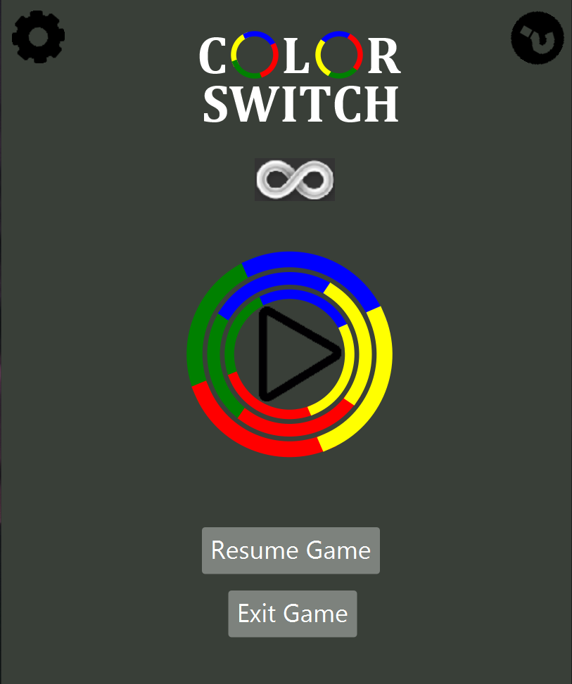
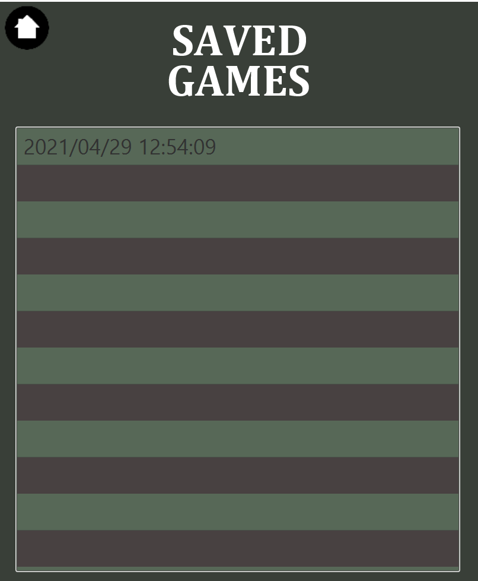
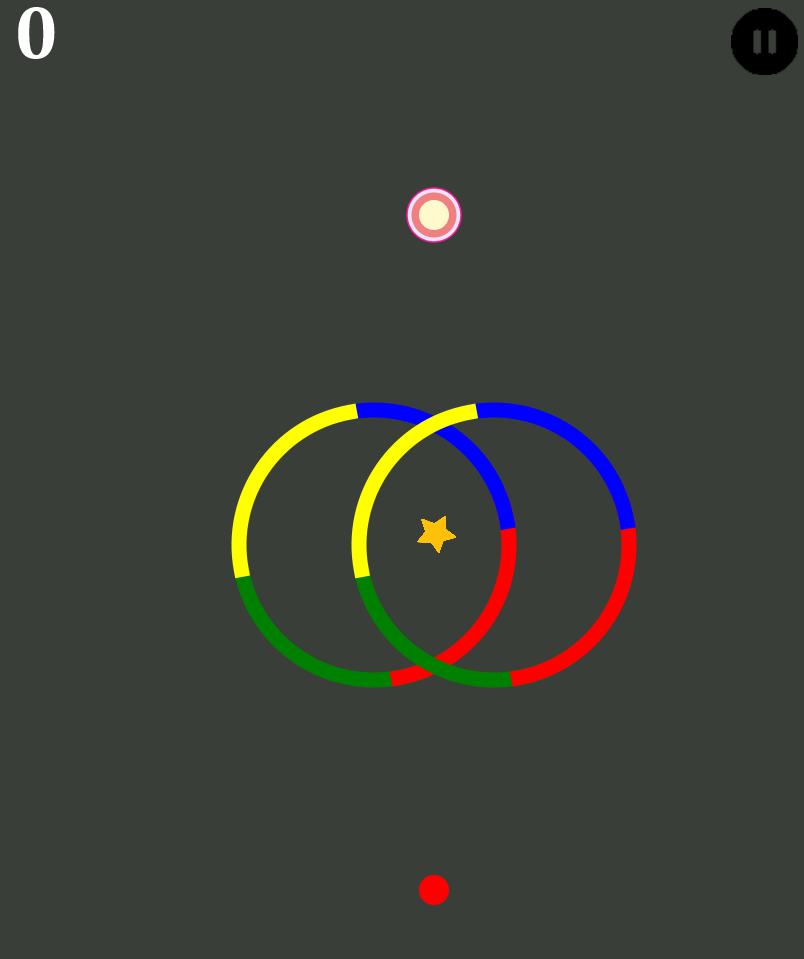
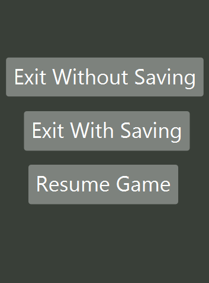
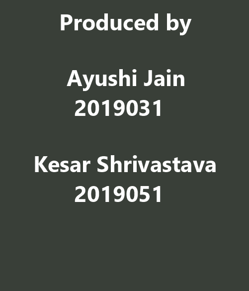

# Color Switch

Press, press, press to get your ball through the color.

This color switch game resembles the classic endless mode of the game. The designing details can be found out from the UML diagrams.
Two more modes have been implemented called the firefly mode and the converse mode.

 
 
 

 
